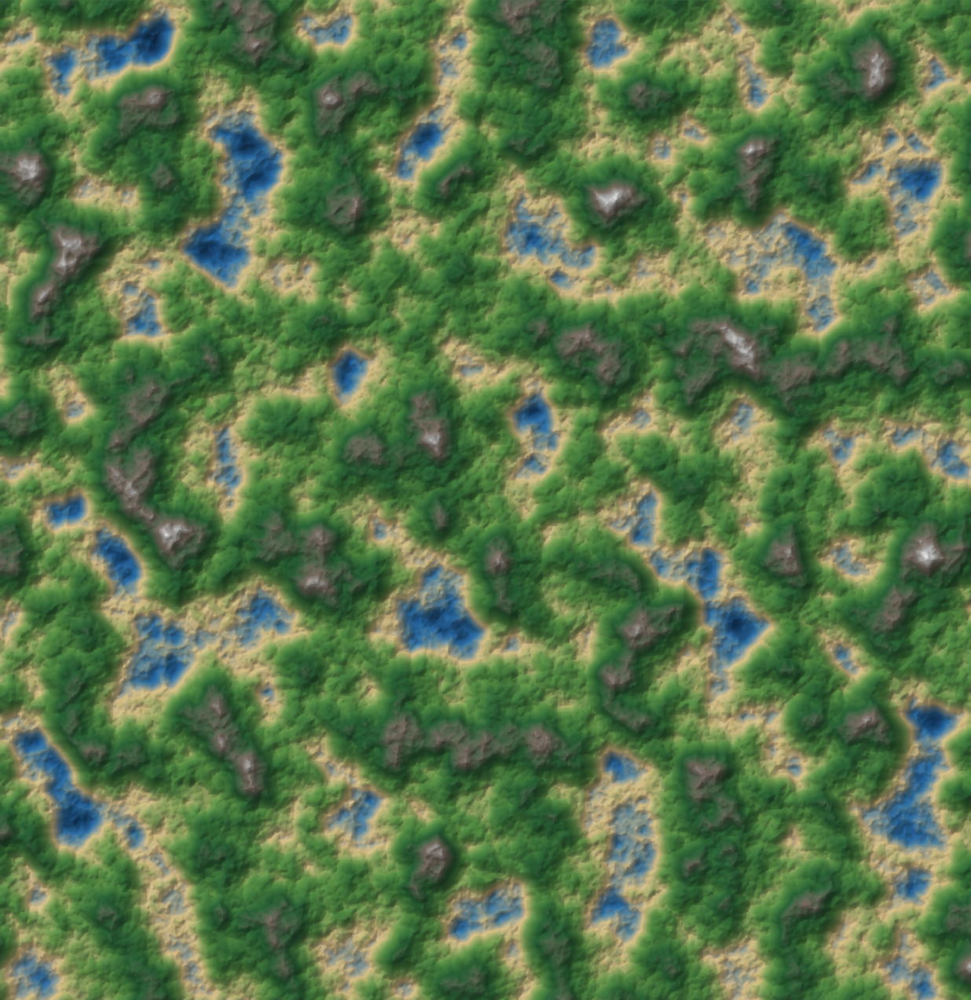

# Terrain Generator

A C++20 desktop terrain generator that turns seeded Perlin noise into an
eroded 2D heightmap. The application renders the terrain with OpenGL, supports
interactive camera controls and colour maps, and can save or load terrain files
through native Windows file dialogs.



## Highlights

- Parallel Perlin heightmap generation using independent row workers.
- Double-buffered, multithreaded thermal erosion that avoids concurrent writes
  to terrain cells.
- Two regeneration modes: completed background generation or visible,
  step-by-step erosion.
- OpenGL heightmap viewer with pan, cursor-centred zoom, hill shading, and
  selectable colour maps.
- Binary terrain save and load support (`.trn`) using the Windows file picker.
- Built-in benchmark for the complete CPU terrain pipeline.

## Controls

| Input | Action |
|---|---|
| `R` | Generate a new random seed and display the completed terrain when ready. |
| `A` | Generate a new random seed, then animate thermal erosion. |
| `B` | Benchmark five complete terrain generations. The window pauses while it runs. |
| `S` | Choose a location and save the current terrain. |
| `L` | Choose a terrain file to load. |
| `C` | Cycle the terrain colour map. |
| `K` | Toggle control messages. |
| Mouse wheel | Zoom towards the cursor. |
| Middle mouse drag | Pan the terrain. |
| `Home` | Reset the camera. |

## Technology

- C++20
- CMake 3.20+
- OpenGL, GLFW, and GLAD
- vcpkg manifest mode for dependencies
- Windows common dialogs for save/load selection

## Build and run

### Prerequisites

- Visual Studio 2019 or newer with the Desktop development with C++ workload.
- CMake 3.20 or newer.
- [vcpkg](https://github.com/microsoft/vcpkg), with `VCPKG_ROOT` set to its
  installation directory.

Dependencies are declared in `vcpkg.json` and are installed automatically when
CMake configures the project with the vcpkg toolchain.

### Release build

Run these commands from the repository root in PowerShell:

```powershell
cmake -S . -B build "-DCMAKE_TOOLCHAIN_FILE=$env:VCPKG_ROOT\scripts\buildsystems\vcpkg.cmake"
cmake --build build --config Release
.\build\Release\TerrainGenerator.exe
```

Use the `Release` configuration for performance measurements. In VS Code, the
play button runs the currently selected CMake configuration; select the
`Release` variant before building and launching.

## Performance

The `B` control runs `TerrainGenerator::generate()` five times using the default
512 x 512 terrain settings: six Perlin octaves, scale `0.02`, and 50 erosion
iterations. It measures CPU terrain generation only; rendering, texture uploads,
window work, and file I/O are excluded.

Current local Release measurement:

| Run | Time (ms) |
|---:|---:|
| 1 | 85.435 |
| 2 | 84.064 |
| 3 | 101.824 |
| 4 | 87.434 |
| 5 | 97.285 |
| Average | **91.208** |

Timings vary with CPU model, background activity, compiler version, and build
configuration.

## Project structure

```text
src/
  app/        Save/load and application state
  benchmark/  Terrain-pipeline timing
  input/      Key and mouse input
  maths/      Noise and vector utilities
  render/     Window, camera, shaders, and OpenGL rendering
  terrain/    Heightmap generation, erosion, chunks, and world types
```

## How generation works

1. A seeded Perlin-noise generator creates a base heightmap.
2. Independent row ranges are generated in parallel across available CPU
   workers.
3. Thermal erosion calculates sediment outflow, gathers neighbouring inflow into
   a second buffer, then swaps buffers for the next iteration.
4. The completed heightmap is uploaded as an OpenGL texture and shaded in the
   terrain fragment shader.

`R` performs the complete pipeline on a background task. `A` builds the base
map in the background, then applies erosion in small visible batches on the main
loop.

## Roadmap

- 3 x 3 terrain chunk grid.
- 3D terrain rendering mode.
- Terrain-file format validation and automated save/load round-trip tests.

## Notes

The current file-picker implementation uses Windows common dialogs, so the
save/load interface is Windows-specific. The core terrain generation and
rendering code remain standard C++ and OpenGL based.
